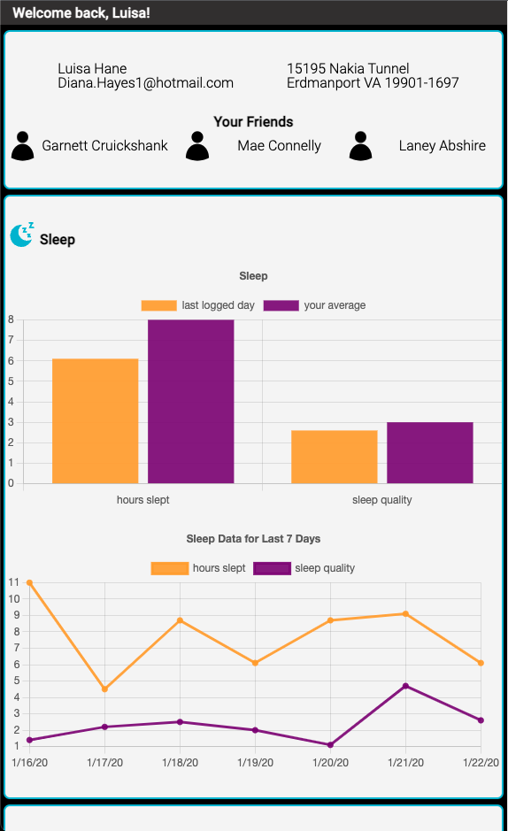
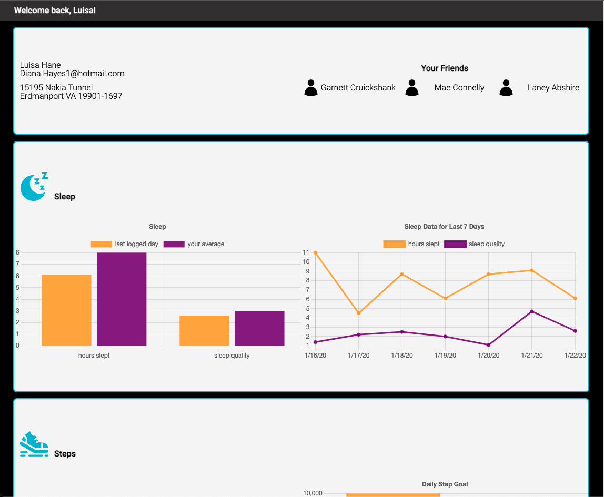

# FitLit Starter Kit

The basis of this project are taken from [this project spec](https://frontend.turing.edu/projects/Fitlit-part-one.html), but I took the liberty to alter some things due to data limitations. I chose this project so I could practice all aspects of a vanilla JavaScript/CSS application. This project uses technologies and features such as: multiple classes, API calls, and a library for rendering charts.

## Setup
1. Fork or clone this repository
2. Run `npm install` to install project dependencies
3. Run `npm start` to complile and start the application. Open `http://localhost:8080/` in your browser to view the application. `Control + C` is the command to stop running the local server.
4. Run `npm test` to run all tests

## Screenhots
##### Mobile View



##### Desktop View



## Data Model

**Users**

```
[
  {
    "id": [number],
    "name": [string],
    "address": [string],
    "email": [string],
    "strideLength": [number - feet],
    "dailyStepGoal": [number - steps],
    "friends": [array - one-way connection to other user(s)]
  },
  ...more user data
]
```

**Activity**

```
[
  {
    "userID": [number],
    "date": [string YYYY/MM/DD],
    "numSteps": [number - steps],
    "minutesActive": [number - minutes],
    "flightsOfStairs": [number - flights]
  },
  ...more activity data
]
```

**Hydration**

```
[
  {
    "userID": [number],
    "date": [string YYYY/MM/DD],
    "numOunces": [number - ounces]
  },
  ...more hydration data
]
```

**Sleep**

```
[
  {
    "userID": [number],
    "date": [string YYYY/MM/DD],
    "hoursSlept": [number - hours],
    "sleepQuality": [number - unitless]
  },
  ...more sleep data
]
```
